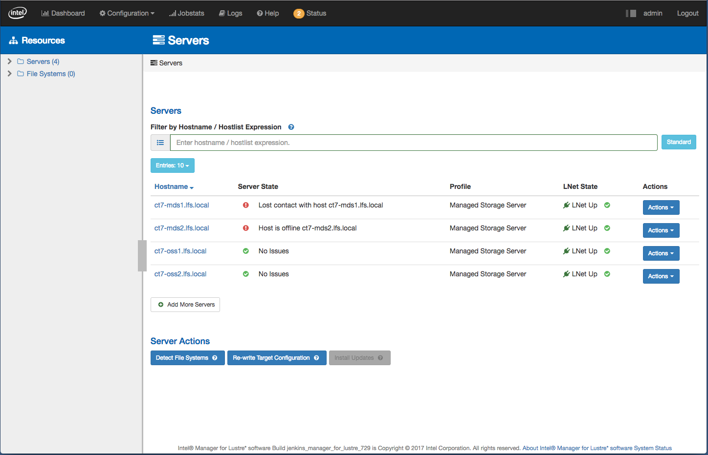

[**Table of Contents**](index.md)

# Introduction

### **IML** stands for Intel Manager for Lustre.
### **IML** is responsible for the installation, configuration, monitoring, and overall management of [Lustre®](http://lustre.org/). 

The Lustre® file system is an open-source, parallel file system, generally used for large-scale cluster computing. 

### Below are some screen shots of **IML:**

## Login Screen

## Server Screen

* More [IML Screenshots](IML_Screen_Shots.md)

## Source Code
Before accessing our source code repository for the first time, new contributors should have a good understanding of the tools and processes in place.
* Become very familiar with [git](Git_Reference.md).
* Become familiar with the [IML codebase](https://github.com/intel-hpdd).
* Learn the [IML contributor workflow](IML_Contributor_Workflow.md).
* Understand How to Contribute to the [Frontend](Contribute_To_Frontend_Quick_Guide.md) and/or [Backend](Contribute_To_Backend_Quick_Guide.md) Code.
* Be ready to learn new things.

## Frontend Code and Backend Code
IML consists of a **Frontend GUI** that is written primarily in **Node JS** and server-side **Backend** code that is written primarily in **python**. The codebase relies on many external dependencies and uses many services and APIs.

The [IML codebase](https://github.com/intel-hpdd) consists of many repositories due to the varying needs and varying dependencies.

### The primary IML repos of importance for a contributor are:

| Repo Name | Description |
|-----------|-------------| 
| [intel-manager-for-lustre](https://github.com/intel-hpdd/intel-manager-for-lustre) | Consider this as the *Top level* repo populated mostly with python code. |
| [GUI](https://github.com/intel-hpdd/GUI) | The Graphical User Interface for the Single Page Application, IML. This is primarily nodejs code with angular and inferno libraries. |
| [manager-for-lustre-dependencies](https://github.com/intel-hpdd/manager-for-lustre-dependencies) | Dependencies needed for IML that are not available elsewhere. |
| [view-server](https://github.com/intel-hpdd/view-server) | Server client-side files. |
| [socket-worker](https://github.com/intel-hpdd/socket-worker) | Off main thread data munging.|
| [realtime](https://github.com/intel-hpdd/realtime) | WebSocket Proxy over RESTful API.  |
| [Vagrantfiles](https://github.com/intel-hpdd/Vagrantfiles) | Configuration used to generate a virtual lustre clustre with vagrant and virtualBox.
| | |

## Dependencies for IML
### High level python dependencies include:
* The [django](https://www.djangoproject.com/) web application framework.
* [Tastypie](https://django-tastypie.readthedocs.io/en/latest/) webservice API framework for Django used as the REST-api.
* [django-south](https://south.readthedocs.io/en/latest/), a tool to provide consistent, easy-to-use and database-agnostic migrations for Django applications.
* [Kombu](https://pypi.python.org/pypi/kombu) messaging library for python.
* [Supervisor](http://supervisord.org/), a system for controlling process state under linux.
* **Robinhood** 

## IML Services
### IML uses the following services:

| Service Name | Description |
|-----------|-------------| 
| supervisor | A client/server system that allows its users to monitor and control a number of processes on UNIX-like operating systems. |
| corosync | A group communication system with additional features for implementing high availability within applications. |               
| gunicorn | 'Green Unicorn' is a Python WSGI HTTP Server for UNIX.  | 
| http_agent | | 
| job_scheduler  | |
| lustre_audit | |
| plugin_runner | |
| power_control  | |
| realtime  | |
| stats | |
| syslog | |
| view_server | |
|  | |
  

